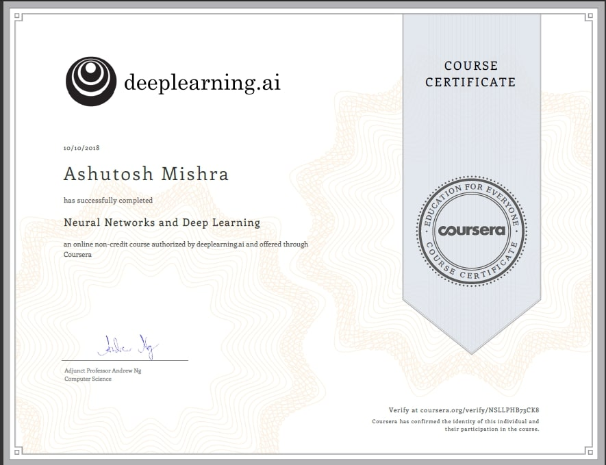
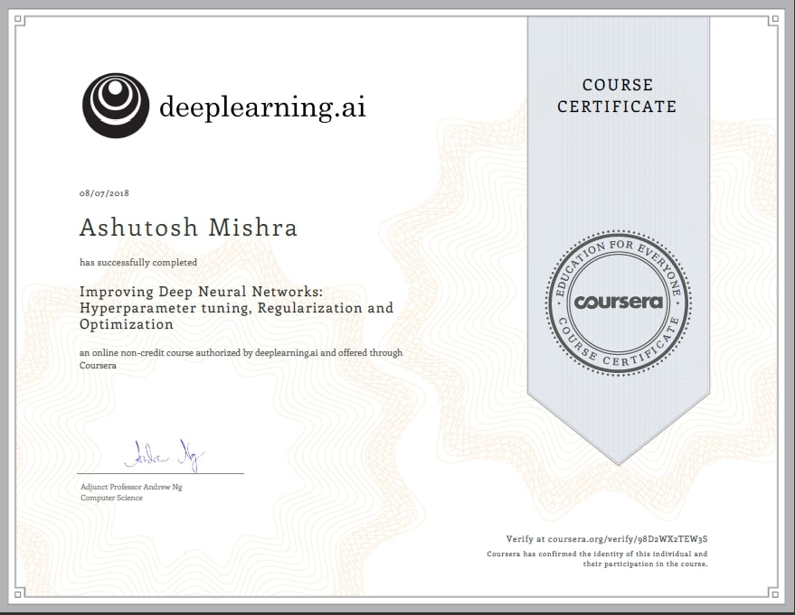
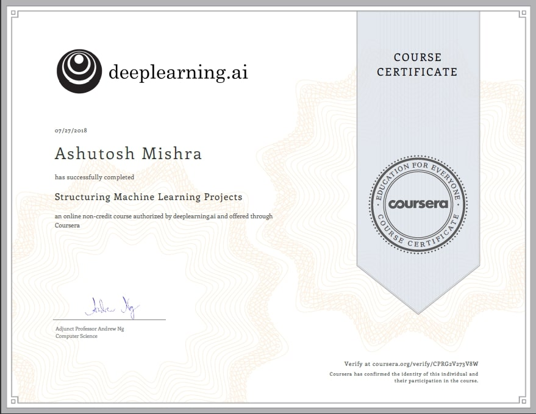
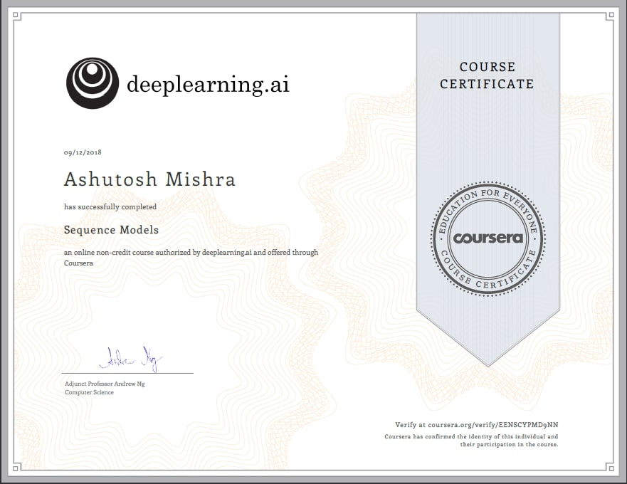
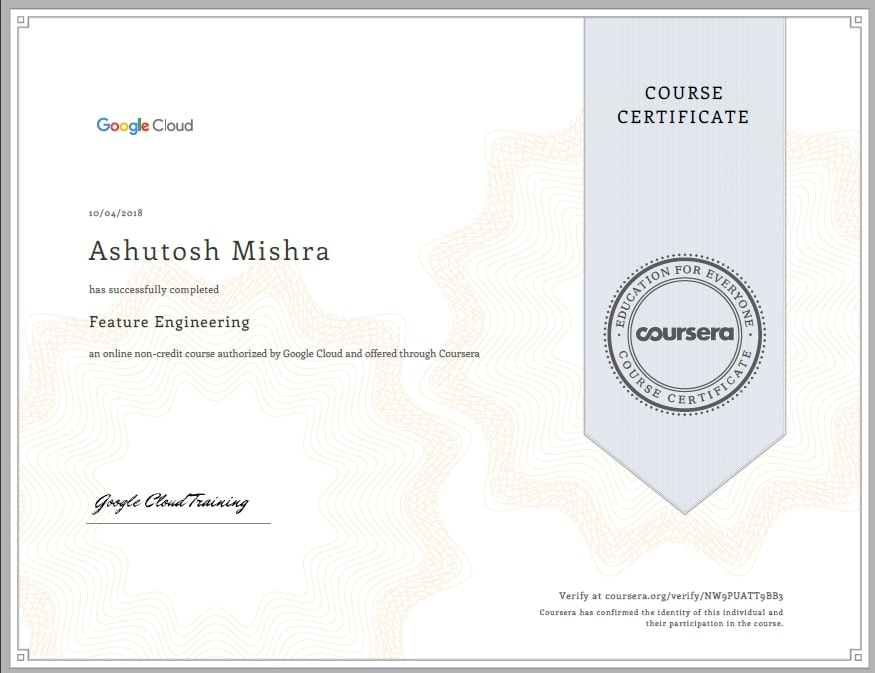

# Ashutosh Mishra    
   
I am Ashutosh Mishra. I am from Bhubaneswar, Odisha. I am interested in machine learning and Artificial Intelligence. I am a curious bug. I love how the ML is changing the world. I would love to be in the front of the war for AI.   

Contact :
- MahavirNagar, Bhubaneshwar, Odisha
- Phone : (+91)8018-642428    
- Email : [prog.mishra@gmail.com](prog.mishra@gmail.com)

## Social Media
    

## Skills

<table class="tg">
  <tr>
    <th class="tg-s268">Machine Learning</th>
    <th class="tg-s268">Deep Learning</th>
    <th class="tg-s268">Natural Language Processing</th>
    <th class="tg-s268">Image Processing</th>
    <th class="tg-s268">Data Visualization</th>
    <th class="tg-s268">Cloud Computing</th>
    <th class="tg-s268">SQL</th>
    <th class="tg-s268">Python</th>
    <th class="tg-s268">Java</th>
    <th class="tg-s268">C++</th>
  </tr>
</table>    

## Frameworks

<table class="tg">
  <tr>
    <th class="tg-s268">Tensorflow</th>
    <th class="tg-s268">Pytorch</th>
    <th class="tg-s268">NLTK</th>
    <th class="tg-s268">Keras</th>
    <th class="tg-s268">SKLearn</th>
    <th class="tg-s268">OpenCV</th>
    <th class="tg-s268">MongoDB</th>
    <th class="tg-s268">Flask</th>
    <th class="tg-s268">Django</th>
  </tr>
</table>   

## Work Experience

### 1. Data Science Intern with __IntelIndexer LLC__ (01/2018-03/2018)
- Process economic/finance domain algorithms and methods for feature extraction.
- Use LSTM, Dynamic Time Wraping, Clustering and scalable methods to build prediction system.
- Create a GDP prediction system with 5% more accurate than IMF.

### 2. Machine Learning Intern with __TINO IQ__ (04/2018-07/2018)
- Financial data modeling.
- Statistical analysis on long term prediction for hedge-funds like S&P 500 with 92% accuracy.
- Testing and developing models for stock price prediction.

## Projects
### 1. [Unique Doodle Generation](https://github.com/ASH1998/Doodle-gan)
- Generating new doodle images for different images using Generative Adversarial Networks.
- Tech : `Python` , `Deep Learning`, `GANs`
- [Github](https://github.com/ASH1998/Doodle-gan) and [Site Link](https://ash1998.github.io/Doodle-gan/)

### 2. [Deep Representation of Textual descriptions](https://ash1998.github.io/Deep-Representation-of-Visual-Descriptions)
- Generating images from text descriptions using Attention-GAN and Stack-GAN.
- Tech : `Python` , `Deep Learning`, `AttnGAN`, `StackGAN`,   `Image Processing`
- [Github](https://github.com/ASH1998/Deep-Representation-of-Visual-Descriptions) and [Site Link](https://ash1998.github.io/Deep-Representation-of-Visual-Descriptions/)

### 3. [Face_eyes_smile-detection](https://github.com/ASH1998/Face_eyes_smile-detection)
-  OpenCV application for face, eyes, smile detection. Building MSI/.exe for windows.
- Tech : `Python` , `OpenCV`, `cx-freeze`
- [Github](https://github.com/ASH1998/Face_eyes_smile-detection) and [Site Link](https://ash1998.github.io/Deep-Representation-of-Visual-Descriptions/)

### 4. [Image Caption Generator](https://github.com/ASH1998/Image-Caption-Generator)
- Generate Captions for images using VGG16 network.
- Tech : `Python` , `Deep Learning`, `torch`, `bi-CNN`
- [Github](https://github.com/ASH1998/Image-Caption-Generator) and [Site Link](https://ash1998.github.io/Doodle-gan/)

### 5. [The BOT](https://github.com/ASH1998/THE-BOT)
- The AI "THE-BOT" is a community driven smart bot which is build using flask and Restful API responsive, which gives you a
Weather, Distance and Your_IP.
- Tech : `Python` , `HTML`, `Geo-track`
- [Github](https://github.com/ASH1998/THE-BOT) and [Site Link](https://ash1998.github.io/Doodle-gan/)

### 6. [BPUT-APP](https://github.com/ASH1998/BPUT-APP)
- The AI "THE-BOT" is a community driven smart bot which is build using flask and Restful API responsive, which gives you a
Weather, Distance and Your_IP.
- Tech : `Python` , `HTML`, `Selenium`, `ghost-browser`
- [Github](https://github.com/ASH1998/BPUT-APP) and [Site Link](https://ash1998.github.io/Doodle-gan/)

## Education

<table class="tg">
  <tr>
    <th class="tg-s268">Certification</th>
    <th class="tg-s268">Subject</th>
    <th class="tg-s268">Date Completed</th>
    <th class="tg-s268">University/School</th>
  </tr>
  <tr>
    <td class="tg-s268">Bachelor of Technology(B.Tech)</td>
    <td class="tg-s268">Computer Science Engineering and Applications</td>
    <td class="tg-s268">2019</td>
    <td class="tg-s268">Indira Gandhi Instt. of Technology(IGIT)</td>
  </tr>
  <tr>
    <td class="tg-s268">High School</td>
    <td class="tg-s268">Computer Science</td>
    <td class="tg-s268">2015</td>
    <td class="tg-s268">DAV Public School, PKT</td>
  </tr>
  <tr>
    <td class="tg-0lax">Secondary</td>
    <td class="tg-0lax">Science</td>
    <td class="tg-0lax">2013</td>
    <td class="tg-0lax">DAV Public School, GC</td>
  </tr>
</table>

## Certificates

### A. Coursera    

<table class="tg">
  <tr>
    <th class="tg-0pky">Certificate</th>
    <th class="tg-0pky">Link</th>
    <th class="tg-0pky">Image</th>
    <th class="tg-0pky">License No. </th>
  </tr>
  <tr>
    <td class="tg-0pky">Neural Networks and Deep Learning</td>
    <td class="tg-0pky"><a href="https://github.com/ASH1998/ash1998.github.io/blob/master/static%5CCertificates%5CCoursera_neural_networks_NSLLPHB73CK8.pdf">View as PDF</a></td>
    <td class="tg-0pky"></td>
    <td class="tg-0pky">NSLLPHB73CK8 </td>
  </tr>
  <tr>
    <td class="tg-0pky">Hyperparameter tuning, Regularization and Optimization</td>
    <td class="tg-0pky"><a href="https://github.com/ASH1998/ash1998.github.io/blob/master/static%5CCertificates%5CCoursera_improving_98D2WX2TEW3S.pdf">View as PDF</a></td>
    <td class="tg-0pky"> </td>
    <td class="tg-0pky">98D2WX2TEW3S</td>
  </tr>
  <tr>
    <td class="tg-0pky">Structuring Machine Learning Projects</td>
    <td class="tg-0pky"><a href="https://github.com/ASH1998/ash1998.github.io/blob/master/static%5CCertificates%5CCoursera_Structuring_Machine_Learning_Projects_CPRG2V273V8W.pdf">View as PDF</a></td>
    <td class="tg-0pky"></td>
    <td class="tg-0pky">CPRG2V273V8W</td>
  </tr>
  <tr>
    <td class="tg-0pky">Sequence Models</td>
    <td class="tg-0pky"><a href="https://github.com/ASH1998/ash1998.github.io/blob/master/static%5CCertificates%5CCoursera_sequencemodels_EENSCYPMD9NN.pdf">View as PDF</a></td>
    <td class="tg-0pky"></td>
    <td class="tg-0pky">EENSCYPMD9NN</td>
  </tr>
  <tr>
    <td class="tg-0pky">Feature Engineering</td>
    <td class="tg-0pky"><a href="https://github.com/ASH1998/ash1998.github.io/blob/master/static/Certificates/Coursera_feature_engineering_NW9PUATT9BB3.pdf">View as PDF</a></td>
    <td class="tg-0pky"></td>
    <td class="tg-0pky">NW9PUATT9BB3</td>
  </tr>
  <tr>
    <td class="tg-0pky"></td>
    <td class="tg-0pky"></td>
    <td class="tg-0pky"></td>
    <td class="tg-0pky"></td>
  </tr>
</table>
### B. Udemy        

## Accomplishments

- TCS IT quiz Qualifier
- Finalist for 1st Smart India Hackathon
